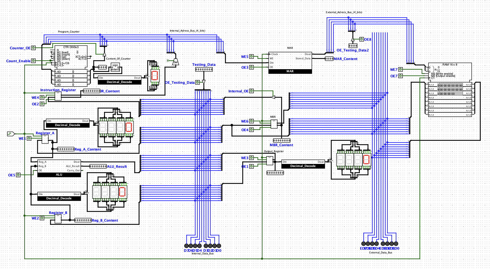
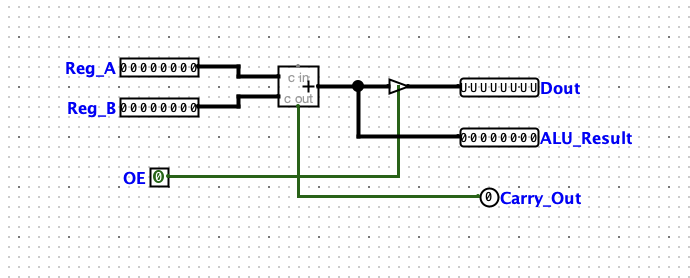
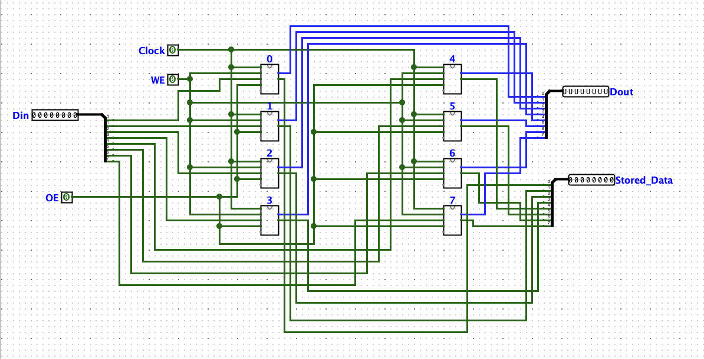
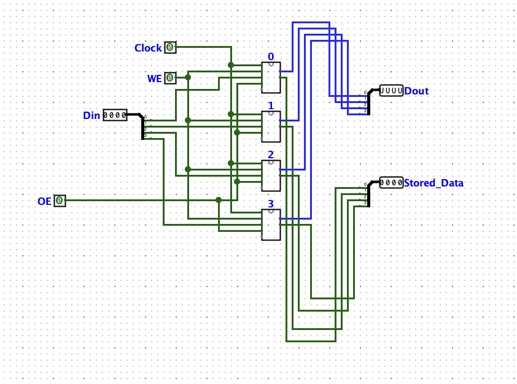
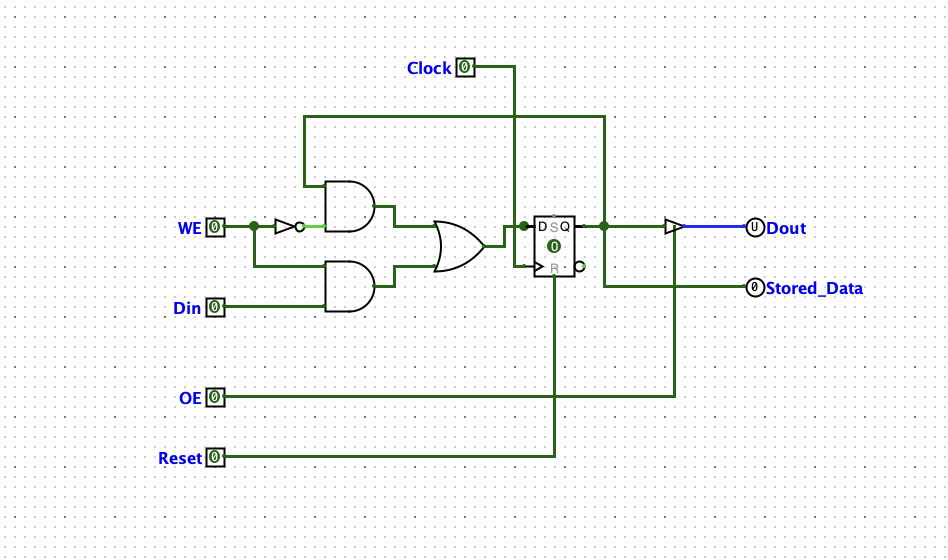
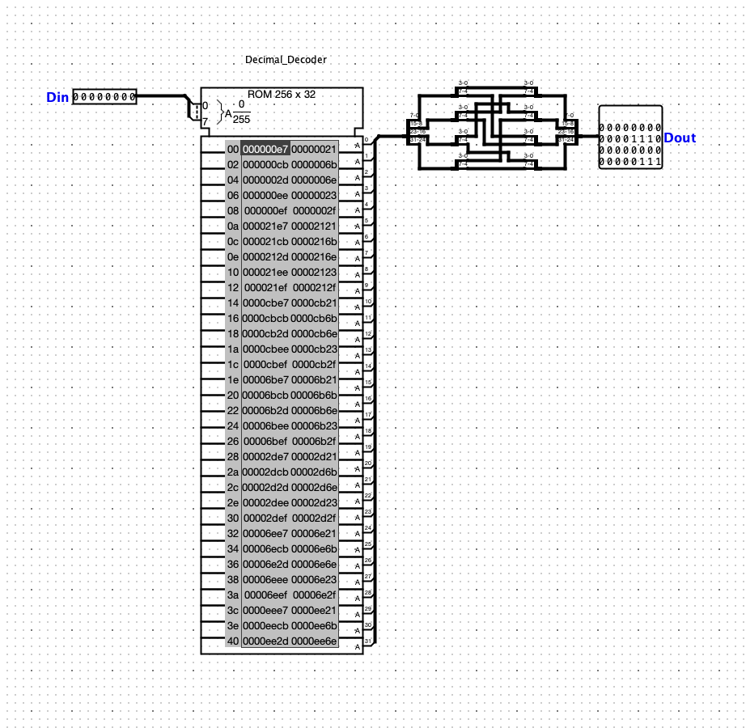

# 8-Bit CPU Design

A simple 8-bit CPU designed and simulated in **Logisim**.

## Overview

This project implements a basic 8-bit CPU from scratch using digital logic components. The design covers all fundamental building blocks of a CPU, wired together into a working simulation.

## Circuit Modules

| Module | Description |
|--------|-------------|
| `main` | Top-level circuit connecting all components |
| `ALU` | Arithmetic Logic Unit — performs addition and logic operations |
| `Register` | 8-bit general-purpose register |
| `MAR` | Memory Address Register |
| `Memory` | RAM module for data storage |
| `Decimal_Decode` | Decodes binary output to 7-segment display |

## Project Files

| File | Description |
|------|-------------|
| `8-bit-CPU-design.circ` | Main Logisim-Evolution circuit file |
| `RAM File` | Memory initialization file — loaded into RAM at simulation start |
| `Decimal Decoder File` | Lookup table used by the Decimal_Decode module |

## Bus Structure

| Bus | Width | Description |
|-----|-------|-------------|
| Internal Data Bus | 8-bit | Connects registers and ALU internally |
| External Data Bus | 8-bit | Interface for external read/write |
| Internal Address Bus | 4-bit | Selects memory address internally |
| External Address Bus | 4-bit | External memory addressing |

## Screenshots

### Main Circuit

### ALU

### Register

### MAR

### Memory

### Decoder

## Requirements

- **[Logisim](http://www.cburch.com/logisim/)** (by Carl Burch)

> **Warning:** This file was created with the original Logisim. Opening it in Logisim-Evolution may cause issues — component pin positions and sizes differ between the two applications, which can break wire connections and require manual fixes.

## Usage

1. Download and install [Logisim](http://www.cburch.com/logisim/)
2. Open `8-bit-CPU-design.circ`
3. Load `RAM File` into the RAM component via **right-click → Load Image**
4. Use the **Simulate** menu to start the clock and step through the circuit
